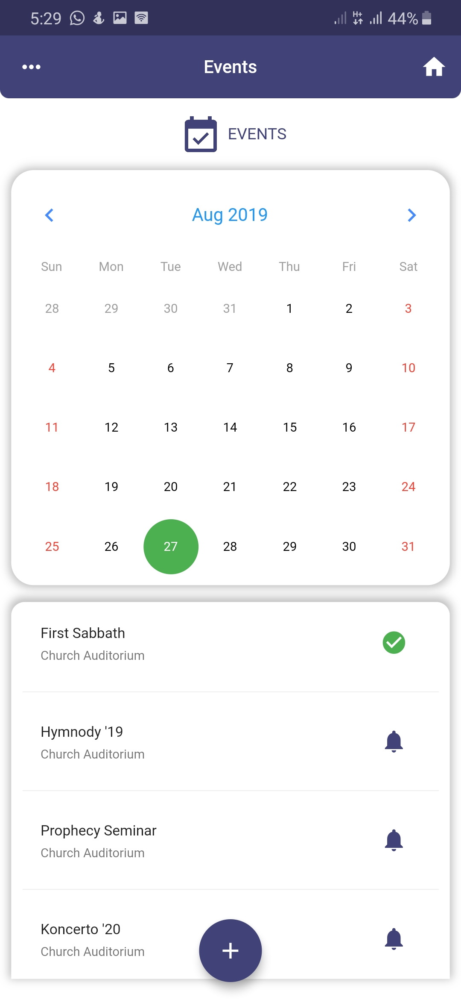
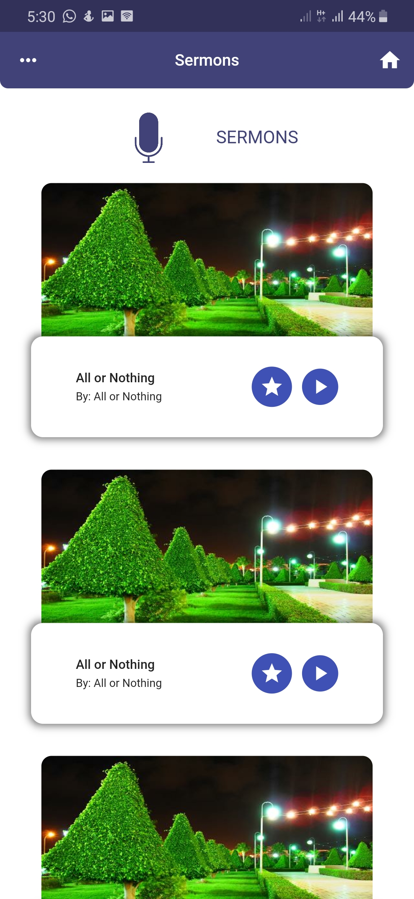

# Church App UI made with Flutter

A church app UI made with Flutter.  
Lookup the original work on [Beehance](https://www.behance.net/gallery/67216667/Church-Nexus-App-UI-Design)

#### Concept UI

<table>
    <tr>
        <td>Main Screen (Landing Page)</td>
        <td>Main Screen (Landing Page)</td>
        <td>Menu Screen</td>
    </tr>
    <tr>
        <td></td>
        <td></td>
        <td></td>
    </tr>
    <tr>
        <td>Events Page</td>
        <td>Sermons Page</td>
        <td>Testimoials Page</td>
    </tr>
    <tr>
        <td></td>
        <td></td>
        <td></td>
    </tr>
</table>

Made with :heart_eyes: by [Akora-IngDKB](https://github.com/Akora-IngDKB).  
Please show some :heart: by giving this repo as :star: as I will be updating it with time.  

### Getting Started

A few resources to get you started if this is your first Flutter project:

- [Lab: Write your first Flutter app](https://flutter.dev/docs/get-started/codelab)
- [Cookbook: Useful Flutter samples](https://flutter.dev/docs/cookbook)

For help getting started with Flutter, view our
[online documentation](https://flutter.dev/docs), which offers tutorials,
samples, guidance on mobile development, and a full API reference.